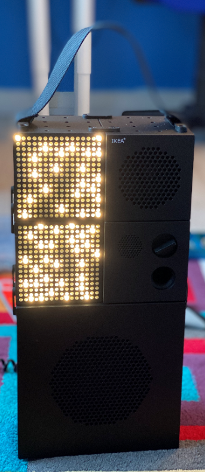

# Frekvens-stuff-from-Rob

I think the Frekvens stuff is wonderful. And I love the way that owners are being encouraged to extend the platform to add bits and bobs.

If I make any parts I'll pop them here. I'll post the STL and the OpenSCAD files, along with the Gcodes that I sent to my venerable old Ultimaker 1 which I'm using to print them.

The designs don't need any support and should just print as they are.

If you like them, let me know on my blog:

[www.robmiles.com](https://www.robmiles.com)

Rob Miles