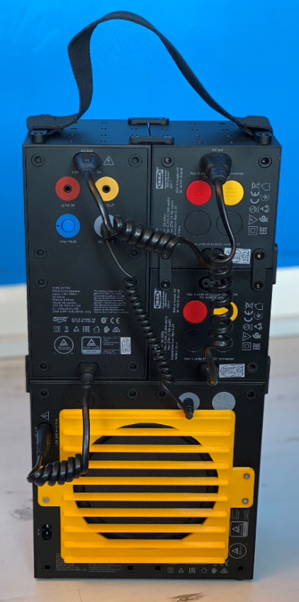

# Subwoofer Speaker Cover
If you've got an [Ikea Frekvens subwoofer](https://www.ikea.com/gb/en/p/frekvens-speaker-with-subwoofer-black-00431127/) you can print this to protect the big speaker at the back. 

This is a picture of the prototype cover which slightly overlaps the power switch and the subwoofer volume control. The final version has been modified to leave a bit more room.

You will also need to print out four fitting pins. You attach these to the cover using 5mm M3 bolts and they then push into the rubber fittings on the back of the subwoofer.

Note that the cover doesn't fit flush with the back of the subwoofer, there is a bit of clearance so that it doesn't scratch the back of the subwoofer and gives the speaker cone space to move in and out. 
