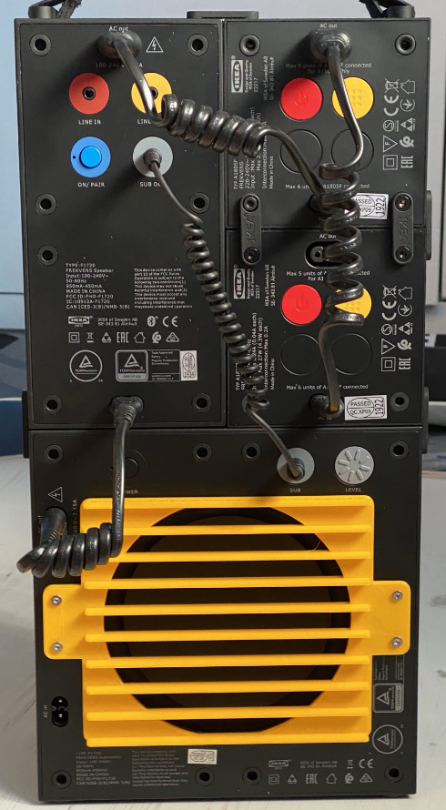

# Subwoofer Speaker Cover
If you've got an [Ikea Frekvens subwoofer](https://www.ikea.com/gb/en/p/frekvens-speaker-with-subwoofer-black-00431127/) you can print this to protect the big speaker at the back. 

---
This is a picture of the prototype which slightly covers the power switch and the subwoofer volume control. The final version has been modified to leave a bit more room.

You will also need to print out four fitting pins. You attach these to the cover using M3 bolts and they then push into the rubber fittings on the back of the subwoofer.
